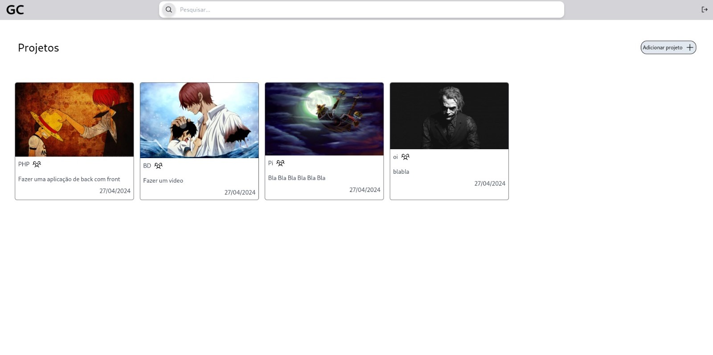

# Plataforma de gerenciamento de tarefas

## Sobre o projeto

O seguinte projeto foi desenvolvido para a disciplina de Projeto Integrador: Programação Orientada a Objetos, 2024.1, trabalhado em equipe com alunos do curso de Análise e desenvolvimento de sistemas e Sistemas da informação.

Necessidade solicitada por outra equipe, para que se desenvolva uma plataforma de gerenciamento de tarefas, que seja simples e intuitiva e atenda aos requisitos.

## Objetivo

O objetivo do sistema é propiciar uma **Plataforma de gerenciamento de tarefas** que
tenha a capacidade de facilitar o planejamento, a organização e os projetos de uma
equipe ou indivíduo. Essencialmente deve ajudar a priorizar atividades, atribuir
responsabilidades, definir prazos e acompanhar o progresso, garantindo uma gestão
mais eficiente do tempo e dos recursos disponíveis, melhorando a colaboração entre os membros da equipe, facilitando a comunicação e atribuições.

## Layout do projeto

### Tela de projetos
 

### Tela de tarefas 

 

## Tecnologias Utilizadas

* HTML
* CSS
* PHP
* TypeScript
* TailWind

## Autores

** Álysson Davi dos Santos de Caldas ** Email institucioanl : alyssondavi@aluno.unifapce.edu.br

